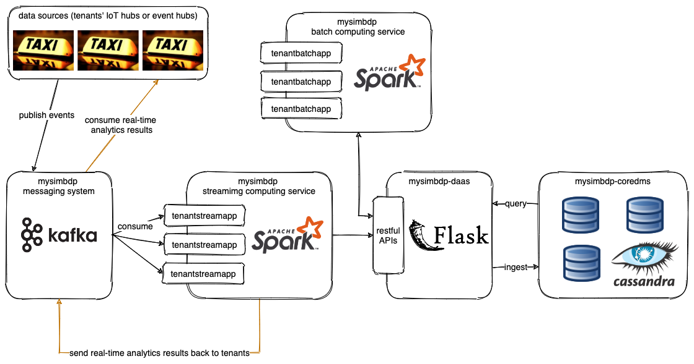
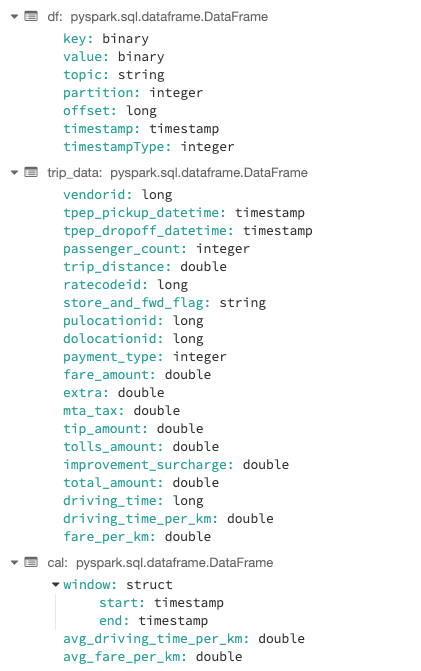
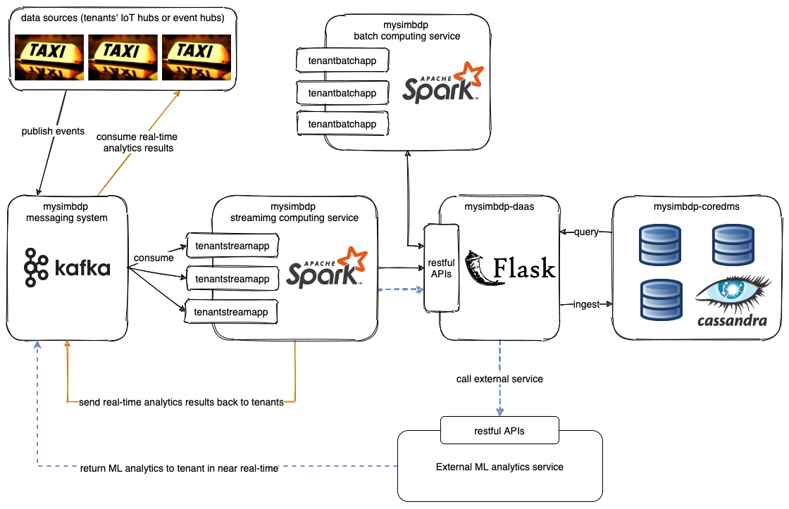
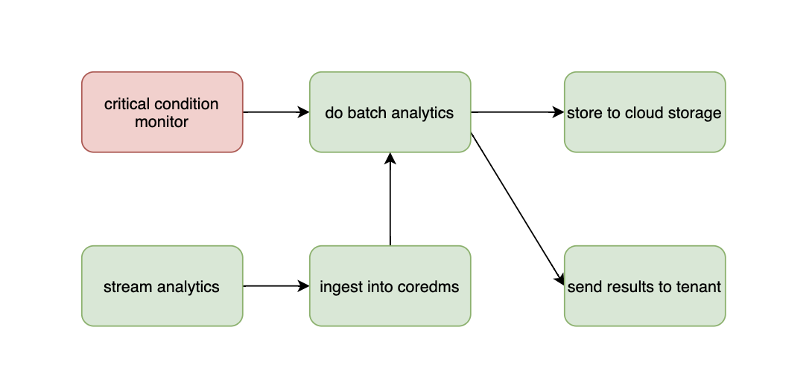

# Big data platform - Assignment 3

## Part 1 - Design for streaming analytics

***

### 1. As a tenant, select a dataset suitable for streaming data analytics as a running scenario. Explain the dataset and why the dataset is suitable for streaming data analytics in your scenario. As a tenant, present at least two different analytics in the interest of the tenant: (i) a streaming analytics (tenantstreamapp) which analyzes streaming data from the tenant and (ii) a batch analytics which analyzes historical results outputted by the streaming analytics. The explanation should be at a high level to allow us to understand the data and possible analytics so that, later on, you can implement and use them in answering other questions. (1 point)

Selected dataset: [**2018 Yellow Taxi Trip Data**](https://data.cityofnewyork.us/Transportation/2018-Yellow-Taxi-Trip-Data/t29m-gskq)

The dataset contains fields capturing pick-up and drop-off dates/times, pick-up and drop-off locations, trip distances, itemized fares, rate types, payment types, and driver-reported passenger counts.

It is of great value for analysing information in many different dimensions such as trip peaks/valleys and traffic conditions of different locations in different time. Even provide real-time computation for every on-going taxi such as estimated driving time and estimated fares.

This kind of data has great timeliness because it is fast-changing, which requires real-time processing otherwise the value of data will be greatly reduced. Thus it is suitable for streaming data analytics.

As a tenant, I would like to do following analytics:

(i) real-time streaming analytics: analyzing "average driving time per kilometer" and "average fare amount per kilometer" in the last 20 minutes.

(ii) batch analytics from historical results: analyzing "trip peaks and valleys of a day", "average trip distance", "average fare of day/month/season and trend", "average tips" and "passenger preferenecs of payment types".

### 2. The tenant will send data through a messaging system which provides stream data sources. Discuss and explain the following aspects for the streaming analytics: (i) should the analytics handle keyed or non-keyed data streams for the tenant data, and (ii) which types of delivery guarantees should be suitable for the stream analytics and why. (1 point)

(i) Yes, using keyed data streams is more reliable and flexible although it takes up more storage space. For my big data platform, the data streams need to be keyed for the purpose of **identifying tenants**, **prevention of duplicated data** and **data partitioning and aggregating**

(ii) In this assignment, Kafka is used for messaging system. Basically Kafka offers delivery guarantees:

- **At-least-once delivery** (a message will not be lost, but it might be delivered more than once)
- **At-most-once delivery**  (a message will only be delivered once, but it might be lost)
- **Exactly-once delivery** (all messages will be delivered exactly one time.)

, which can be achieved through many configurations, such as *message durability, message acknowledgement, consumer offset tracking and isolation level*.

The at-least-once delivery guarantees the message safety but has poorer performance. The at-most-once has good performance, lower latency and higher throughput, but sacrifices the message safety. The exactly-once delivery is very depending on the whole system architecture and operation logic of consumer application.

Personally, I would seek for a way that achieves a balance of message safety and performance.

### 3. Given streaming data from the tenant (selected before). Explain the following issues: (i) which types of time should be associated with stream data sources for the analytics and be considered in stream processing (if the data sources have no timestamps associated with events, then what would be your solution), (ii) which types of windows should be developed for the analytics (if no window, then why), (iii) what could cause out-of-order data/records with your selected data in your running example, and (iv) will watermarks be needed or not, explain why. Explain these aspects and give examples. (1 point)

(i) For the real-time analytics "average driving time per kilometer" specified in question 1, "trip start time" and "trip end time" are needed, luckily, the dataset "Yellow Taxi Trip Data" comes with fields *tpep_pickup_datetime* and *tpep_dropoff_datetime* associated with every event, which are both *timestamp*.

In addition, for the need of monitoring and analysis of message system performance, two more timestamps need to be added:

- event arrival time: added when a message arrives at a consumer
- event completion time: added after a message is processed by a consumer and ready to be sent to final data sink.

(ii) In taxi scenario, affected by the high/low peaks, driving time is different at different times of a day, so if you want to perform some real-time analytics such as "estimated driving time of a on-going trip" should be calculated from **the average driving time of a certain period of time in the past** to satisfy timeliness, rather than the total average driving time in the past. (Of course, the actual calculation method may also take road section, real-time traffic conditions and other information into account)

Given this requirement, windows are needed. *Tumbling windows* are unsuitable because they act on contiguous time intervals; *Hopping windows* are also unsuitable, though it can act on overlapping time segments, events in those segments are not "continuous" because the time segment hops. *Session windows* focus on the events that happen close together, still not "continuous" events. Finally, *sliding windows* moves forward like streaming, in which the events are continuous, therefore, *sliding windows* should be developed for the analytics.

(iii) Causes of out-of-order data could be:

- network delay
- connectivity or network failure
- if the producer has multiple machines to generate events, clock skews might exist between different machines

(iv) Yes, watermarks are needed. For the batch analytics that analyzes historical records, the volume of historical records grows infinitely and rapidly, thus it takes time to process. Watermarks helps to indicate the progress on processing the analytics.

### 4. List performance metrics which would be important for the streaming analytics for your tenant cases. For each metric, explain its definition, how to measure it in your analytics/platform and why it is important for the analytics of the tenant. (1 point)

- Received events: number of received events, counter when a message is received.
- Input events: number of input events, counted when a received message is successfully deserialized.
- Input event bytes: bytes of input events, calculated when a received message is successfully deserialized.
- Output events: number of output events, counted when a received message is normally processed and sent to final data sink.
- Input deserialization errors: number of deserialization failed events, counted when a received message fails to be deserialized.
- Processing errors: number of processing failed events, counted when a received message is successfully deserialized but fails to be processed and sent to final data sink.
- Average processing time: average processing time of a single event, calculated after a received message is processed and ready to be sent to final data sink (will use the two additional time fields specified in the question 3).

By doing so tenants can monitor the efficiency of their stream analytics and success rate of handling events, which helps to improve their stream analytics apps.

### 5. Provide a design of your architecture for the streaming analytics service in which you clarify: tenant data sources, mysimbdp messaging system, mysimbdp streaming computing service, tenant streaming analytics app, mysimbdp-coredms, and other components, if needed. Explain your choices of technologies for implementing your design and reusability of existing assignment works. Note that the result from tenantstreamapp will be sent back to the tenant in near real-time and to ingest into mysimbdp-coredms. (1 point)



- **data sources**: In real life, data sources might be tenant's IoT hub or event hub. In this assignment, the data source is simulated using a CSV file [yellow_taxi_trip_data.csv](../data/yellow_taxi_trip_data.csv) and a python script [tenant_data_producer.py](../code/tenant_data_producer.py) that reads data from the CSV file then publishes to **mysimbdp messaging system**.

- **mysimbdp messaging system**: implemented using Kafka in GCP. In one direction, it receives data from tenants' data sources and then consumed by **tenantstreamapp**. In another direction, it receives real-time analytics results from **tenantstreamapp** and then consumed by tenants.

- **tenantstreamapp**: tenants' stream analytics app, defining what do to with each event. It will be submitted to **mysimbdp streaming computing service** as jobs to execute.

- **mysimbdp streaming computing service**: implemented using Spark. This component provides stream computing service, which excutes **tenantstreamapp**.

- **mysimbdp-daas**: implemented using Flask as previous assignments. It has restful APIs for ingesting data into **mysimbdp-coredms**.

- **mysimbdp-coredms**: implemented using Cassandra in GCP as previous assignments (a cluster of 3 nodes).

- **mysimbdp batch computing service**: implemented using Spark. This component provides batch computing service, which executes batch analytics apps. *(Not implemented in this assignment)*

## Part 2 - Implementation of streaming analytics

***

### 1. As a tenant, implement a tenantstreamapp. Explain (i) the structures of the input streaming data and the analytics output result in your implementation, and (ii) the data serialization/deserialization, for the streaming analytics application (tenantstreamapp). (1 point)

For the **tenantstreamapp**,

1. Input

    **tenantstreampapp** receives messages in serialized JSON format from the **mysimbdp-messaging-system**, then uses Spark to deserialize the messages and load into pyspark.sql.dataframe.DataFrame object. Input data structure:

    ```shell
    +----+--------------------+------------+---------+------+--------------------+-------------+
    | key|               value|       topic|partition|offset|           timestamp|timestampType|
    +----+--------------------+------------+---------+------+--------------------+-------------+
    |null|[7B 22 76 65 6E 6...|tenant1.taxi|        0|   502|2021-04-08 02:42:...|            0|
    |null|[7B 22 76 65 6E 6...|tenant1.taxi|        0|   503|2021-04-08 02:42:...|            0|
    |null|[7B 22 76 65 6E 6...|tenant1.taxi|        0|   504|2021-04-08 02:42:...|            0|
    |null|[7B 22 76 65 6E 6...|tenant1.taxi|        0|   505|2021-04-08 02:42:...|            0|
    |null|[7B 22 76 65 6E 6...|tenant1.taxi|        0|   506|2021-04-08 02:42:...|            0|
    |null|[7B 22 76 65 6E 6...|tenant1.taxi|        0|   507|2021-04-08 02:42:...|            0|
    +----+--------------------+------------+---------+------+--------------------+-------------+
    ```

    where the "value" is the original event data from tenant's data sources, other columns are appended by Kafka.

2. Output
    After processing, **tenantstreampapp** outputs results through two pipelines:

    (1) Call API of **mysimbdp-daas** to ingest data into **mysimbdp-coredms**. Output data structure:

    ```json
    {
        "table_name": "xxxx",
        "data": {
            "vendorid": "",
            "tpep_pickup_datetime": "",
            "tpep_dropoff_datetime": "",
            "passenger_count": "",
            "trip_distance": "",
            "ratecodeid": "",
            "store_and_fwd_flag": "",
            "pulocationid": "",
            "dolocationid": "",
            "payment_type": "",
            "fare_amount": "",
            "extra": "",
            "mta_tax": "",
            "tip_amount": "",
            "tolls_amount": "",
            "improvement_surcharge": "",
            "total_amount": "",
            "driving_time": "",
            "driving_time_per_km": "",
            "fare_per_km": ""
        }
    }
    ```

    where "table_name" represents which table to ingest, "data" represents table data. Data is serialized by ```requests.post()```.

    (2) Publishes back to the tenant. Output data structure:

    ```json
    {
        "avg_driving_time_per_km": 700,
        "avg_fare_per_km": 10
    }
    ```

    where "avg_driving_time_per_km" represents average driving time per kilometer in seconds in the past 20 mins, "avg_fare_per_km" represents average fare amount per kilometer, both data is calculated by total data within the sliding window of 20 mins. Data is serialized by ```pyspark.sql.functions.to_json()```.

### 2. Explain the key logic of functions for processing events/records in tenantstreamapp in your implementation. Explain under which conditions/configurations and how the results are sent back to the tenant in a near real time manner and/or are stored into mysimbdp-coredms as the final sink. (1 point)

Source code of **tenantstreamapp** can be found at [/code/tenantstreamapp.py](../code/tenantstreamapp.py). Detailed steps of the whole app were written as comments on the source file, here will focus on the logic of processing events.

Regarding the logic of processing events, the **tenantstreamapp** leverages *Structured Streaming* to perform the stream analytics, which is a stream processing engine built on the Spark SQL engine.

> Structured Streaming and Spark Streaming are both for streaming process. The difference between them is that Spark Streaming abstracts data streams as DStream (a series of RDDs); while the Structured Streaming abstracts data streams as unbounded DataFrame.
>
> Spark Streaming can only achieve real-time response in seconds, while Structured Streaming adopts a new design that can achieve a real-time response of 100 milliseconds when using a micro-batch processing model, and can support a real-time response of milliseconds when using a continuous processing model.

Firstly, establish the data stream:

```python
# Create a SparkSession object
spark = SparkSession \
    .builder \
    .master(SPARK_MASTER) \
    .appName("tenant1_taxi") \
    .config('spark.jars.packages', 'org.apache.spark:spark-sql-kafka-0-10_2.12:3.1.1') \
    .getOrCreate()
# Then use it to read data stream from Kafka, specify the subscribed topic, and load to DataFrame
df = spark \
    .readStream \
    .format("kafka") \
    .option("kafka.bootstrap.servers", MESSAGE_BROKER) \
    .option("subscribe", TOPIC) \
    .load()
```

Secondly, there are two operations on the dataframe:

(1) compute some additional fields from existing fields, then ingest the whole event into **mysimbdp-coredms**

```python
# Extract the 'value' column, deserialize it and flatten to dataframe columns. Calculate driving_time_per_km and fare_per_km of each event
trip_data = trip_data \
    .selectExpr("CAST(value AS STRING)")
    .select(from_json(col("value"), schema).alias("data")).select("data.*")
    .withColumn("driving_time", unix_timestamp("tpep_dropoff_datetime")-unix_timestamp("tpep_pickup_datetime")) \
    .withColumn("driving_time_per_km", col("driving_time")/col("trip_distance")) \
    .withColumn("fare_per_km", col("fare_amount")/col("trip_distance"))
# Define what to do with each event
def process_row(row):
    # call daas api to ingest each row
    payload = {'table_name': TABLE['table_name'], 'data': {field: row[field] for field in TABLE['fields']}}
    res = requests.post("http://{}/{}/stream_ingest".format(DAAS_API, TENANT_ID), json=payload)
# Output: for each row/event in the transformed dataframe, we set the function process_row as callback.
query = df.writeStream
    .foreach(process_row)
    .start()
```

(2) do some real-time analytics, then send the results back to tenant through **mysimbdp messaging system**

```python
# Set watermark and sliding window and compute average_driving_time_per_km and average_fare_per_km.
cal = trip_data \
    .withWatermark("tpep_dropoff_datetime", "10 minutes") \
    .groupBy(window("tpep_dropoff_datetime", "20 minute", "5 minute")) \
    .agg(avg(col('driving_time_per_km')).alias("avg_driving_time_per_km"), avg(col('fare_per_km')).alias("avg_fare_per_km")) \
# Output: serialize the aggregated results into json, then publish back to kafka for tenant
cal.select(to_json(struct("avg_driving_time_per_km", "avg_fare_per_km")).alias("payload"))
    .writeStream \
    .format("kafka") \
    .option("kafka.bootstrap.servers", MESSAGE_BROKER) \
    .option("topic", "real-time-analystics") \
    .start()
```

### 3. Explain a test environment for testing tenantstreamapp, including how you emulate streaming data, configuration of mysimbdp and other relevant parameters. Run tenantstreamapp and show the operation of the tenantstreamapp with your test environments. Discuss the analytics and its performance observations when you increase/vary the speed of streaming data. (1 point)

As stated in the architecture, the source data is in a CSV file, each row (except the first row) represents a message/event. Example as following:

```csv
"vendorid","tpep_pickup_datetime","tpep_dropoff_datetime","passenger_count","trip_distance","ratecodeid","store_and_fwd_flag","pulocationid","dolocationid","payment_type","fare_amount","extra","mta_tax","tip_amount","tolls_amount","improvement_surcharge","total_amount"
"2","2084-11-04T12:32:24.000","2084-11-04T12:47:41.000","1","1.34","1","N","238","236","2","10","0","0.5","0","0","0.3","10.8"
"2","2084-11-04T12:32:24.000","2084-11-04T12:47:41.000","1","1.34","1","N","238","236","2","10","0","0.5","0","0","0.3","10.8"
"2","2084-11-04T12:25:53.000","2084-11-04T12:29:00.000","1","0.32","1","N","238","238","2","4","0","0.5","0","0","0.3","4.8"
```

To emulate streaming input, Python script [tenant_data_producer.py](../code/tenant_data_producer.py) reads the CSV line by line, serializes each line into a JSON string and publishes to **mysimbdp-messaging-system** using ```KafkaProducer.send()```.

The messaging system Kafka is deployed using [kafka-docker-compose.yml](../code/kafka-docker-compose.py), which has 1 Kafka node and 1 Zookeeper node.

The stream computing service Spark cluster is deployed using [spark-docker-compose.yml](../code/spark-docker-compose.py), which has 1 master node and 2 worker nodes, each work has 1 core and 1G memory.

The coredms Cassandra cluster is deployed in previous assignments, which has 3 nodes.

As the logic stated in the last question, during the operation, the data went through some transformations:


```log
2021-04-08T03:18:39.216+0000: [GC (Allocation Failure) [PSYoungGen: 1656832K->117942K(2061312K)] 1926698K->387809K(7013376K), 0.0682039 secs] [Times: user=0.12 sys=0.00, real=0.07 secs] 
-------------------------------------------
Batch: 2
-------------------------------------------
+--------+--------------------+---------------------+---------------+-------------+----------+------------------+------------+------------+------------+-----------+-----+-------+----------+------------+---------------------+------------+------------+-------------------+------------------+
|vendorid|tpep_pickup_datetime|tpep_dropoff_datetime|passenger_count|trip_distance|ratecodeid|store_and_fwd_flag|pulocationid|dolocationid|payment_type|fare_amount|extra|mta_tax|tip_amount|tolls_amount|improvement_surcharge|total_amount|driving_time|driving_time_per_km|       fare_per_km|
+--------+--------------------+---------------------+---------------+-------------+----------+------------------+------------+------------+------------+-----------+-----+-------+----------+------------+---------------------+------------+------------+-------------------+------------------+
|       2| 2084-11-04 11:27:28|  2084-11-04 11:39:52|              1|         1.07|         1|                 N|         170|          68|           2|        9.0|  0.0|    0.5|       0.0|         0.0|                  0.3|         9.8|         744|  695.3271028037383| 8.411214953271028|
|       2| 2084-11-04 11:19:06|  2084-11-04 11:26:44|              1|          1.3|         1|                 N|         107|         170|           2|        7.5|  0.0|    0.5|       0.0|         0.0|                  0.3|         8.3|         458|  352.3076923076923| 5.769230769230769|
|       2| 2084-11-04 11:19:06|  2084-11-04 11:26:44|              1|          1.3|         1|                 N|         107|         170|           2|        7.5|  0.0|    0.5|       0.0|         0.0|                  0.3|         8.3|         458|  352.3076923076923| 5.769230769230769|
|       2| 2084-11-04 11:02:59|  2084-11-04 11:15:51|              1|         1.85|         1|                 N|         113|         137|           2|       10.0|  0.0|    0.5|       0.0|         0.0|                  0.3|        10.8|         772|  417.2972972972973| 5.405405405405405|
|       2| 2084-11-04 11:02:59|  2084-11-04 11:15:51|              1|         1.85|         1|                 N|         113|         137|           2|       10.0|  0.0|    0.5|       0.0|         0.0|                  0.3|        10.8|         772|  417.2972972972973| 5.405405405405405|
|       2| 2084-11-04 10:46:05|  2084-11-04 10:50:09|              1|         0.62|         1|                 N|         231|         231|           2|        4.5|  0.0|    0.5|       0.0|         0.0|                  0.3|         5.3|         244|  393.5483870967742| 7.258064516129032|
|       2| 2084-11-04 10:46:05|  2084-11-04 10:50:09|              1|         0.62|         1|                 N|         231|         231|           2|        4.5|  0.0|    0.5|       0.0|         0.0|                  0.3|         5.3|         244|  393.5483870967742| 7.258064516129032|
|       2| 2053-07-11 13:25:33|  2053-07-11 13:25:33|              1|          0.0|         1|                 N|         264|         264|           2|        0.0|  0.0|    0.0|       0.0|         0.0|                  0.0|         0.0|           0|               null|              null|
|       2| 2042-12-04 08:51:43|  2042-12-04 08:54:47|              1|         0.29|         1|                 N|         162|         162|           2|        4.0|  0.0|    0.5|       0.0|         0.0|                  0.3|         4.8|         184|  634.4827586206897|13.793103448275863|
|       2| 2042-12-04 08:51:43|  2042-12-04 08:54:47|              1|         0.29|         1|                 N|         162|         162|           2|        4.0|  0.0|    0.5|       0.0|         0.0|                  0.3|         4.8|         184|  634.4827586206897|13.793103448275863|
|       2| 2041-06-25 20:46:37|  2041-06-25 20:52:37|              1|         1.34|         1|                 N|         239|         151|           2|        7.0|  0.5|    0.5|       0.0|         0.0|                  0.3|         8.3|         360| 268.65671641791045| 5.223880597014925|
+--------+--------------------+---------------------+---------------+-------------+----------+------------------+------------+------------+------------+-----------+-----+-------+----------+------------+---------------------+------------+------------+-------------------+------------------+


2021-04-08T03:19:14.290+0000: [GC (Allocation Failure) [PSYoungGen: 1925029K->264638K(1952256K)] 2194896K->534505K(6904320K), 0.1390743 secs] [Times: user=0.20 sys=0.00, real=0.14 secs] 
-------------------------------------------
Batch: 2
-------------------------------------------
+--------------------+-----------------------+------------------+
|              window|avg_driving_time_per_km|   avg_fare_per_km|
+--------------------+-----------------------+------------------+
|{2042-12-04 08:45...|      634.4827586206897|13.793103448275863|
|{2084-11-04 11:40...|      658.1818181818182| 7.575757575757576|
|{2084-11-04 12:10...|      516.7820945945946| 8.952702702702702|
|{2084-11-04 11:10...|      384.8024948024948| 5.587318087318087|
|{2084-11-04 10:40...|      393.5483870967742| 7.258064516129032|
|{2084-11-04 11:05...|      417.2972972972973| 5.405405405405405|
|{2053-07-11 13:15...|                   null|              null|
|{2084-11-04 12:15...|      516.7820945945946| 8.952702702702702|
|{2041-06-25 20:45...|     268.65671641791045| 5.223880597014925|
|{2084-11-04 10:45...|      393.5483870967742| 7.258064516129032|
|{2041-06-25 20:50...|     268.65671641791045| 5.223880597014925|
|{2042-12-04 08:35...|      634.4827586206897|13.793103448275863|
|{2084-11-04 10:50...|      393.5483870967742| 7.258064516129032|
|{2041-06-25 20:40...|     268.65671641791045| 5.223880597014925|
|{2053-07-11 13:10...|                   null|              null|
|{2084-11-04 11:45...|      658.1818181818182| 7.575757575757576|
|{2053-07-11 13:20...|                   null|              null|
|{2084-11-04 11:20...|      523.8173975557153| 7.090222861250899|
|{2084-11-04 11:30...|      695.3271028037383| 8.411214953271028|
|{2084-11-04 11:55...|      658.1818181818182| 7.575757575757576|
+--------------------+-----------------------+------------------+
only showing top 20 rows
```

### 4. Present your tests and explain them for the situation in which wrong data is sent from or is within the data sources. Explain how you emulate wrong data for your tests. Report how your implementation deals with that (e.g., exceptions, failures, and decreasing performance). You should test with different error rates. (1 point)

To emulate wrong data in input streams, I manually deleted some fields which can be found in [/data/emulate_wrong_data.csv](../data/emulate_wrong_data.csv).

```csv
"vendorid","tpep_pickup_datetime","tpep_dropoff_datetime","passenger_count","trip_distance","ratecodeid","store_and_fwd_flag","pulocationid","dolocationid","payment_type","fare_amount","extra","mta_tax","tip_amount","tolls_amount","improvement_surcharge","total_amount"
"2","2084-11-04T12:32:24.000","2084-11-04T12:47:41.000","1","1.34","1","N","238","236","2","10","0","0.5","0","0","0.3","10.8"
"2","2084-11-04T12:32:24.000","","1","1.34","1","N","238","236","2","10","0","0.5","0","0","0.3","10.8"
"2","2084-11-04T12:25:53.000","2084-11-04T12:29:00.000","1","0.32","1","N","238","238","2","4","0","0.5","0","0","0.3","4.8"
"2","2084-11-04T12:25:53.000","2084-11-04T12:29:00.000","1","0.32","1","N","238","238","2","4","0","0.5","0","0","0.3","4.8"
"2","","2084-11-04T12:22:24.000","1","1.85","1","N","236","238","2","10","0","0.5","0","0","0.3","10.8"
"2","2084-11-04T12:08:33.000","2084-11-04T12:22:24.000","1","","1","N","236","238","2","10","0","0.5","0","0","0.3","10.8"
"2","2084-11-04T11:41:35.000","2084-11-04T11:59:41.000","1","1.65","1","N","68","237","2","12.5","0","0.5","0","0","0.3","13.3"
"2","2084-11-04T11:41:35.000","2084-11-04T11:59:41.000","1","1.65","1","N","68","","2","12.5","0","0.5","0","0","0.3","13.3"
"2","2084-11-04T11:27:28.000","","1","1.07","1","N","170","68","2","9","0","0.5","0","0","0.3","9.8"
"2","2084-11-04T11:27:28.000","2084-11-04T11:39:52.000","1","1.07","1","N","170","68","2","9","0","0.5","0","0","0.3","9.8"
"2","2084-11-04T11:19:06.000","2084-11-04T11:26:44.000","1","1.30","1","N","107","170","2","7.5","0","0.5","0","0","","8.3"
"2","2084-11-04T11:19:06.000","2084-11-04T11:26:44.000","1","1.30","1","N","107","170","2","7.5","","0.5","0","0","0.3","8.3"
"2","2084-11-04T11:02:59.000","2084-11-04T11:15:51.000","","1.85","1","N","113","137","2","10","0","0.5","0","0","0.3","10.8"
```

In tenantstreamapp, during the action of extracting and deserializing the 'value' field from Kafka, value checks should be done, if find some required value missing, this message should not be processed in normaly way, instead it should be recorded and counted as a "input deserialization error" for tenants to check. In my design, a wrong message is published to Kafka in in this format:

```json
{
    "tenant_id": "tenantxxxx",
    "error_type": "input_deserialization_error",
    "message": {}
}
```

there is a dedicated topic for error messages in messaging system, and a dedicated program consumes from it and records it.

### 5. Explain parallelism settings in your implementation and test with different (higher) degrees of parallelism for at least two instances of tenantstreamapp (e.g., using different subsets of the same dataset). Report the performance and issues you have observed in your testing environments. (1 point)

Now I have to manually start the tenantstreamapp twice for multiple instances, after using two instances of consumer, the consumption speed from Kafka is obviously quicker than the case of using only one tenantstreamapp.

## Part 2 - Extension

***

### 1. Assume that you have an external RESTful (micro) service which accepts a batch of data and performs a type of analytics and returns the result (e.g., in case of a dynamic machine learning inference) in a near real time manner (like the stream analytics app), how would you connect such a service into your current platform? Explain what the tenant must do in order to use such a service. (1 point)

I would add a field in the config of tenants' **tenantstreamapp** for tenants to specify what additional services they want to perform.

Then the logic of **tenantstreamapp** will have one more output path: using the [DataFrame.writeStream.foreachBatch()](https://spark.apache.org/docs/latest/structured-streaming-programming-guide.html#foreachbatch) to send the batches to **mysimbdp-daas API**, where the request will be checked if the tenant has this permission or subscription, or just records the batch size for furthur changing. After that **mysimbdp-daas** will forward the batches to the external analytics service by calling its RESTful APIs, including the information of the messaging system topic which it should publish the results to for tenants.

The blue dashed path shows how I would connect such a service:



### 2. Given the output of streaming analytics stored in mysimbdp-coredms for a long time. Explain a batch analytics (see also Part 1, question 1) that could be used to analyze such historical data. How would you implement it? (1 point)

Recall that the results stored into **mysimbdp-coredms** is like following:

```json
{
    "table_name": "xxxx",
    "data": {
        "vendorid": "",
        "tpep_pickup_datetime": "",
        "tpep_dropoff_datetime": "",
        "passenger_count": "",
        "trip_distance": "",
        "ratecodeid": "",
        "store_and_fwd_flag": "",
        "pulocationid": "",
        "dolocationid": "",
        "payment_type": "",
        "fare_amount": "",
        "extra": "",
        "mta_tax": "",
        "tip_amount": "",
        "tolls_amount": "",
        "improvement_surcharge": "",
        "total_amount": "",
        "driving_time": "",
        "driving_time_per_km": "",
        "fare_per_km": ""
    }
}
```

Given massive historical data, there are many kinds of batch analytics can be performed, e.g. "payment type preferences" based on *payment_type*, "distribution of taxi trip distances" based on *trip distance*, "driving speed changing curve over time" based on *driving_time_per_km* and "distribution of tip amount in taxi" based on *tip_amount*.

For example, if I want to know *For what the travel distances people are most willing to take a taxi?* or say *Comparison of people's willingness to take a taxi and travel distances*. I would write a *tenantbatchapp* submitting to *mysimbdp batch computing service*, which regularly calls mysimbdp-daas API to load historical data into dataframe, then perform count() grouped by different ranges of *trip_distance*.

### 3. Assume that the streaming analytics detects a critical condition (e.g., a very high rate of alerts) that should trigger the execution of a batch analytics to analyze historical data. The result of the batch analytics will be shared into a cloud storage and a user within the tenant will receive the information about the result. Explain how you will use workflow technologies to coordinate these interactions and tasks (use a figure to explain your work). (1 point)

I would use Airflow to schedule tasks:


### 4. If you want to scale your streaming analytics service for many tenants, many streaming apps, and data, which components would you focus and which techniques you want to use? (1 point)

I would focus on how to auto scaling the **messaging system** and **stream computing service**, because they are where most IO and computing mainly take place. I have some experience in cloud computing so when thinking about this problem I first thought of Kubernetes.

As I researched on it, I learned that at present, most big data platforms are based on the Hadoop ecosystem, using Yarn as a core component for resource management and scheduling. However, such platforms generally have the following problems:

- Insufficient resource elasticity, unable to automatically expand on demand
- Low resource utilization
- Poor resource isolation
- Difficulty in system management

While Kubernetes as a docker cluster orchestration system actually works in a similar way as YARN does. Building big data platforms based on Kubernetes has been becoming popular in recent years, it can to some extent address above problems. More and more big data components has start to support Kubernetes, for example Spark has supported since version 2.3, thus I would use Kubernetes.

### 5. Is it possible to achieve end-to-end exactly once delivery in your current tenantstreamapp design and implementation? If yes, explain why. If not, what could be conditions and changes to achieve end-to-end exactly once? If it is impossible to have end-to-end exactly once delivery in your view, explain why. (1 point)

Kafka offers many features to achieve exactly-once delivery:

Use sequence number mechanism similar to TCP to ensure the idempotency of producers publishing messages to Kafka.

Use transaction to ensure the atomicity of writing a batch of messages to multiple partitions.

Use Streams API to offer end-to-end exactly-once guarantees for stream processing.

It’s possible to achieve exactly-once delivery when using Kafka as message broker, but so far my tenantstreamapp has not support exactly-once delivery because it automatically commits offset now. If a consumer crashes during processing a message, the message it is responsible for has not been successfully processed yet but the offset has been committed, it leads to this message is lost.

The key is to make sure a message has been successfully handled before committing offset. So changes need to be done is not using auto commit offset, while the consumer app should handle the logic of committing the offset after successfully processing a message.
